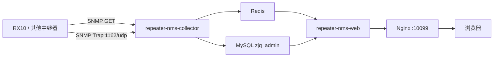

# repeater-nms

`repeater-nms` 是一个面向 10G IPVB 中继器的网管系统。当前第一版已围绕博汇 `RX10` 完成设备管理、SNMP GET 采集、SNMP Trap 接收与展示、告警管理、基础 Web 页面、Redis 实时推送和服务器部署。

项目业务名统一使用 `repeater-nms`，Python 包名统一使用 `repeater_nms`。

## 当前状态

- 当前阶段：阶段6已完成
- 代码仓库：`repeater_nms`
- 服务器部署目录：`/home/jkxz/yves-admin`
- Web 服务：`repeater-nms-web`
- 采集服务：`repeater-nms-collector`
- 对外访问端口：`10099`
- 数据库：MySQL `zjq_admin`
- Redis channel 前缀：`repeater_nms`

## 第一版已实现范围

- 用户登录、退出、角色区分
- 用户管理
- 设备管理
- 设备模板管理
- MIB 节点、枚举、采集策略、告警规则管理
- SNMP GET 轮询采集
- SNMP v2c Trap 接收
- RX10 `almchg` 与 `performance` Trap 解析
- 同一 Trap PDU 多告警拆分
- 告警归一化、活动告警、告警确认
- Redis pub/sub + SSE 实时推送
- Trap 实时页面、Trap 详情页
- 设备运行总览
- 操作日志
- systemd + Nginx 部署

## 技术栈

- Python 3
- Flask
- SQLAlchemy
- PyMySQL
- Flask-Login
- Redis Python client
- Gunicorn
- pysnmp
- MySQL
- Redis
- Nginx

## 系统架构



### 进程职责

- `repeater-nms-web`
  - Flask API
  - 模板页面
  - 登录鉴权
  - Trap 查询
  - 告警中心
  - SSE 输出

- `repeater-nms-collector`
  - SNMP GET 轮询
  - SNMP Trap 监听
  - OID/MIB 翻译
  - Trap PDU 多告警拆分
  - 告警归一化
  - MySQL 写入
  - Redis 发布

## 目录结构

```text
repeater_nms/
  collector/          Trap、轮询、归一化、发布
  db/                 模型、初始化、种子数据、session
  web/                Flask 页面、API、模板、鉴权
deploy/
  nginx/              Nginx 站点配置
  systemd/            systemd service 文件
docs/
  REQUIREMENTS.md
  MIB_MAP.md
  DEPLOYMENT.md
  PROJECT_STATE.md
tests/
```

## 数据库设计

### 约束

- 只使用 MySQL `zjq_admin`
- 所有业务表必须使用 `repeater_` 前缀
- 不允许修改非 `repeater_` 表
- 初始化脚本必须幂等
- 种子数据不可重复插入
- 时间统一按 UTC 入库，前端按 `Asia/Shanghai` 展示

### 核心表

- `repeater_users`
  - 用户、密码哈希、角色、启停状态

- `repeater_devices`
  - 设备基础信息
  - 包含 `snmp_port`、`trap_port`
  - 记录 `last_polled_at`、`last_poll_status`、`last_poll_message`、`last_online_at`

- `repeater_device_profiles`
  - 设备模板
  - 当前内置 `bohui_rx10`

- `repeater_mib_nodes`
  - MIB/OID 节点定义
  - 归属具体 `profile_code`

- `repeater_mib_enums`
  - 枚举翻译定义

- `repeater_polling_strategies`
  - 采集策略
  - 包含采集周期、启停、是否保存历史、是否首页展示、判断规则

- `repeater_snmp_metric_samples`
  - 历史采集样本

- `repeater_device_latest_values`
  - 每台设备每个 OID 的最新值
  - 页面总览和设备详情优先读取这里

- `repeater_trap_events`
  - Trap 拆分后的事件表
  - 保存 `raw_json`、`translated_json`
  - 同一个 Trap PDU 拆分后的多条事件保留相同 `pdu_id`

- `repeater_alarm_rules`
  - 告警规则
  - 包含默认级别、是否生成活动告警、是否弹窗

- `repeater_active_alarms`
  - 活动告警表
  - 去重键：`device_id + alarm_obj + alarm_id`

- `repeater_alarm_events`
  - 告警事件时间线
  - 保存 `report / change / close`

- `repeater_alarm_ack_logs`
  - 告警确认日志

- `repeater_popup_notifications`
  - 弹窗通知记录

- `repeater_operation_logs`
  - 操作日志

### 关键索引

- `device_id`
- `received_at`
- `severity`
- `status`
- `alarm_id`
- `alarm_obj`
- `pdu_id`
- `created_at`

## 采集与 Trap 逻辑

### SNMP GET

- collector 按 `repeater_polling_strategies` 读取启用策略
- 按设备模板筛选可用 OID
- 对每个 OID 执行 SNMP GET
- 成功或失败都写历史样本
- 最新结果 upsert 到 `repeater_device_latest_values`
- 同步更新 `repeater_devices.last_poll_*`
- 最新轮询快照写入 Redis：
  - `repeater_nms:device:{device_id}:latest_poll`

### Trap 接收

- 监听 `0.0.0.0:1162/udp`
- 设备匹配优先使用 Trap UDP 源 IP
- 一个 Trap PDU 可能拆分出多条告警事件
- 每条拆分事件单独入库到 `repeater_trap_events`
- `raw_json` 保存原始报文
- `translated_json` 保存翻译结果

### 告警逻辑

- `report / change` 且规则允许时，生成或更新活动告警
- `close` 或 `severity=cleared` 时关闭活动告警
- 同一活动告警重复上报时只更新计数和最后时间
- critical/major 可触发弹窗
- `cleared/close` 不允许作为活动告警确认按钮

### Redis 与 SSE

- collector 每拆分一条 Trap 事件，就发布一条 Redis 消息：
  - `repeater_nms:trap_events`
- Web 端 SSE 订阅 Redis channel
- 浏览器通过 `EventSource` 接收实时 Trap
- MySQL 是持久化主存储，Redis 不是主数据源

## 设备模板机制

当前系统已不再把 `RX10` 写死为唯一设备，已经支持设备模板。

当前内置模板：

- `profile_code = bohui_rx10`
- `vendor = 博汇`
- `model = RX10`
- `category = 中继器`

后续增加其他品牌或型号时，优先新增模板、MIB、枚举、采集策略和告警规则，不需要改 collector 主流程。

## 本地开发

### 1. 创建虚拟环境

```powershell
python -m venv .venv
.venv\Scripts\python -m pip install -r requirements-dev.txt
```

### 2. 初始化数据库

```powershell
.venv\Scripts\python -m flask --app wsgi init-db
```

### 3. 启动 Web

```powershell
.venv\Scripts\python -m flask --app wsgi run --debug
```

### 4. 启动 collector

```powershell
.venv\Scripts\python -m repeater_nms.collector
```

### 5. 本地试运行脚本

```powershell
powershell -ExecutionPolicy Bypass -File .\scripts\run_local_trial.ps1
```

### 6. 执行测试

```powershell
.venv\Scripts\python -m pytest
```

## 服务器启动与运维

### 目录

- 项目目录：`/home/jkxz/yves-admin`
- 虚拟环境：`/home/jkxz/yves-admin/.venv`
- 服务文件：
  - `/etc/systemd/system/repeater-nms-web.service`
  - `/etc/systemd/system/repeater-nms-collector.service`
- Nginx 站点：
  - `/etc/nginx/sites-available/repeater-nms`

### 首次初始化

```bash
cd /home/jkxz/yves-admin
source .venv/bin/activate
python -m flask --app wsgi init-db
```

### 启停服务

```bash
sudo systemctl restart repeater-nms-web
sudo systemctl restart repeater-nms-collector
sudo systemctl status repeater-nms-web repeater-nms-collector --no-pager
```

### Nginx 检查与重载

```bash
sudo nginx -t
sudo systemctl reload nginx
```

### 常用检查

```bash
ss -luntp | egrep ':10099|:5000|:1162|:3306|:6379'
redis-cli ping
sudo journalctl -u repeater-nms-web -n 50 --no-pager
sudo journalctl -u repeater-nms-collector -n 50 --no-pager
```

## 安全说明

- 仓库只保留 `.env.example`
- 真实 `.env` 只放服务器部署目录
- 不在 Git、日志或页面中明文暴露：
  - 数据库密码
  - SNMP read/write community
  - 管理员密码
- 数据库仅允许操作 `zjq_admin` 中的 `repeater_` 表

## 当前验收结论

阶段6已完成，当前版本已经达到第一版目标：

- Web 可访问
- 设备可管理
- SNMP 轮询可用
- Trap 接收可用
- 同一 PDU 多事件拆分可用
- 告警中心可用
- Redis + SSE 实时链路可用
- 服务可通过 systemd 和 Nginx 运维

更细的当前状态请看：

- `docs/PROJECT_STATE.md`
- `docs/DEPLOYMENT.md`
- `docs/MIB_MAP.md`
